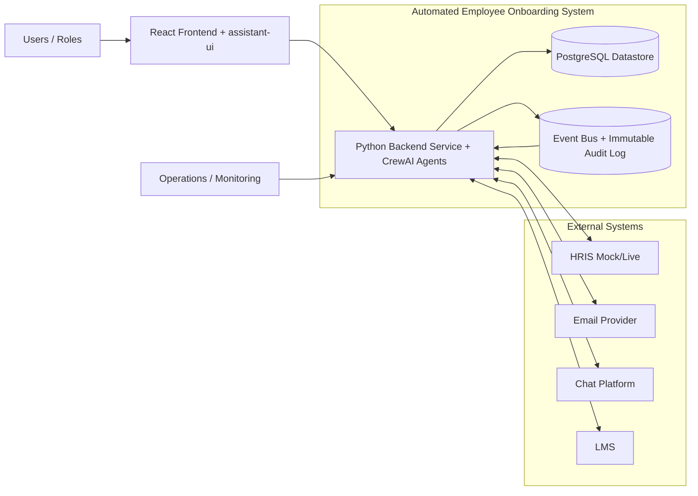
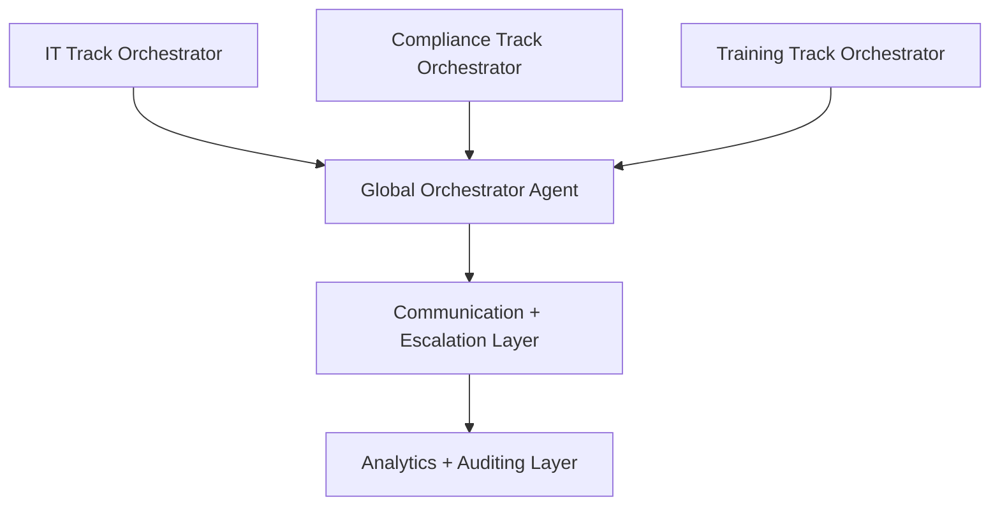
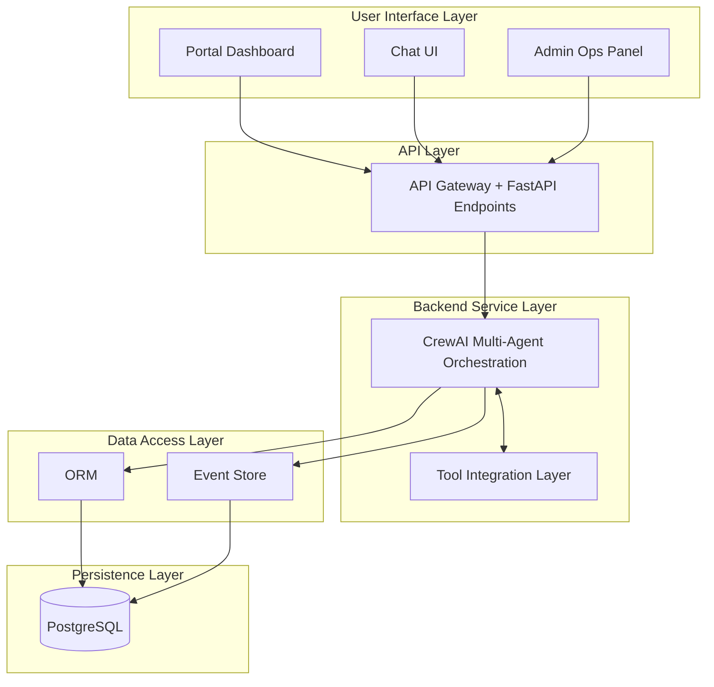
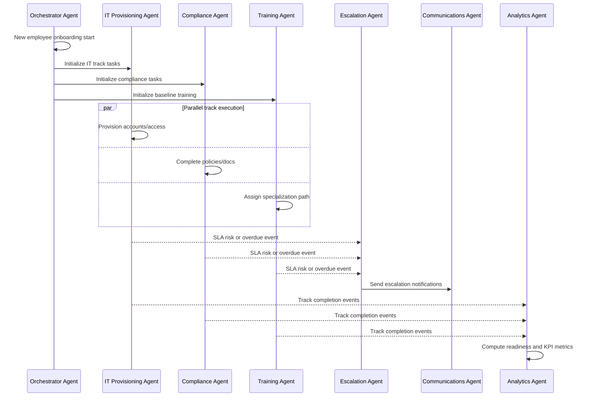
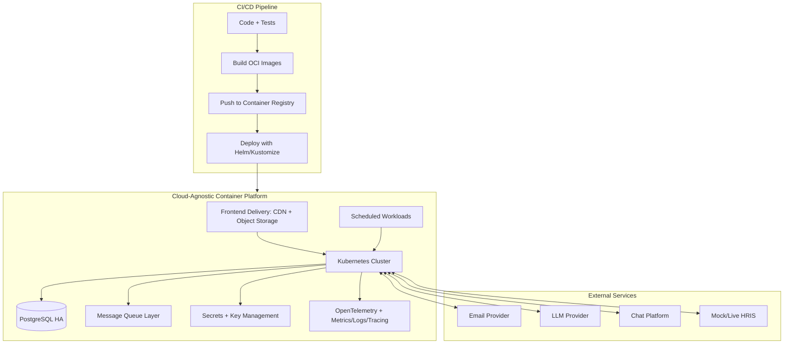
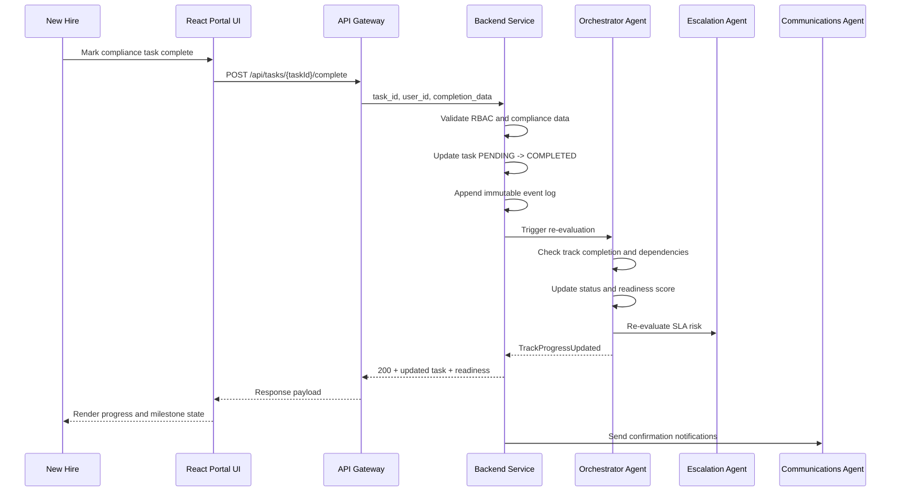
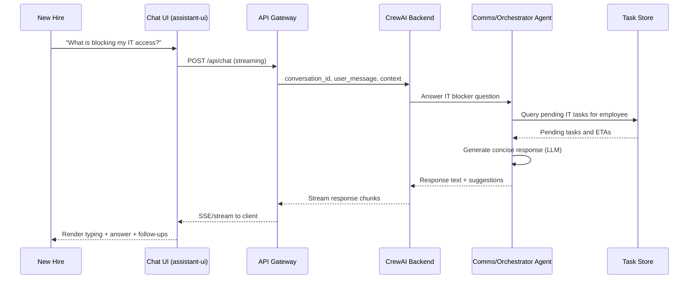
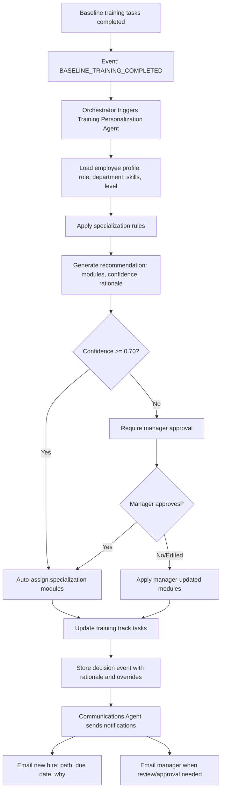
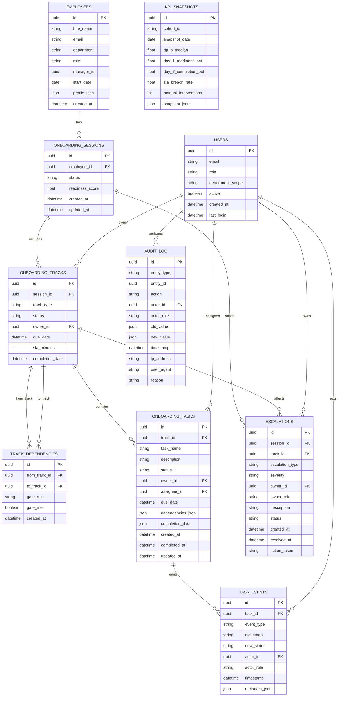
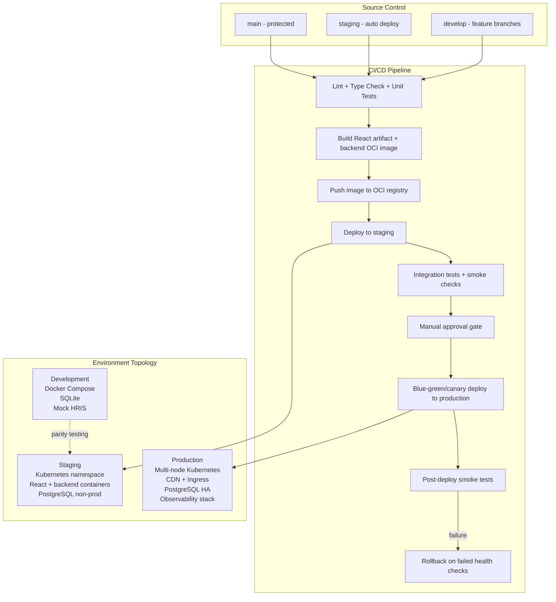

# System Architecture Document (SAD)
## Automated Employee Onboarding Flow

**Version**: 1.0 (MVP)  
**Date**: 2026-05-08  
**Owner Persona**: System Architect (@system.arch)  
**Primary Inputs**:
- [project-context/1.define/mrd.md](../mrd.md)
- [project-context/1.define/prd.md](../prd.md)

---

## Executive Summary

This document specifies the complete system architecture for an automated, multi-agent employee onboarding orchestration platform for US mid-market technology companies (101-1000 employees). The system orchestrates three parallel onboarding tracks—IT Provisioning, Compliance Checks, and Personalized Training Paths—using a CrewAI-based multi-agent backend, React frontend with assistant-ui chat interface, and event-driven workflow orchestration.

**Core Innovation**: Parallel track orchestration with explainable AI decisions, deterministic SLA enforcement, and unified cross-role visibility.

**MVP Scope**: 7 specialized CrewAI agents, REST/streaming APIs, role-based dashboards, email + chat + portal channels, audit-complete telemetry.

**Target Outcomes**: ≥20% reduction in time-to-productivity proxy, ≥90% day 1 readiness, ≥85% day 7 completion, operationally measurable SLA performance.

---

## 1. Stakeholder Concerns & System Drivers

### 1.1 Stakeholder Identification

| Stakeholder | Concern | Priority |
|---|---|---|
| **HR Operations Manager** | Unified control plane, SLA enforcement, escalation visibility | Critical |
| **IT Administrator** | Complete request validation, clear task queue, status predictability | Critical |
| **Hiring Manager** | New hire readiness confidence, day 7/day 30 milestone visibility | High |
| **New Hire (End User)** | Clear next steps, transparent progress, contextual support | Critical |
| **People/Ops Leadership** | Measurable KPI deltas (time-to-productivity reduction), cost efficiency | High |
| **Engineering/DevOps** | Operational reliability, observability, low infra cost, fast deployment | High |
| **Compliance/Security** | Audit trails, RBAC, PII minimization, data lifecycle controls | Critical |

### 1.2 System Drivers & Constraints

**Business Drivers**:
- Market gap: mid-market companies lack parallel orchestration + SLA accountability between enterprise suites and lightweight tools.
- KPI imperative: measurable time-to-productivity reduction is primary proof criterion.
- Timeline: MVP ready within capstone project window.
- Cost: low infrastructure footprint and minimal LLM token usage.

**Architectural Drivers**:
- **Parallelism**: Three tracks must execute concurrently with independent state machines and cross-track dependency gates.
- **Explainability**: All AI-driven decisions (training specialization, recommendations, escalations) must include reasoning for audit and trust.
- **Auditability**: Complete immutable event log for compliance and forensics.
- **Determinism**: Workflow rules, SLA enforcement, and state transitions must be rule-based; AI used only for bounded recommendation tasks.

**Technical Constraints**:
- **Framework**: CrewAI for multi-agent orchestration (as specified in MRD/PRD).
- **Frontend**: React 18+ (Vite build pipeline) with assistant-ui for streaming chat interface.
- **Deployment**: Cloud-agnostic, container-first platform using OCI images and Kubernetes-compatible orchestration.
- **Performance**: p95 API latency ≤800ms, event processing ≤5s, notification dispatch within 2 minutes.
- **Scale**: Support ≥500 active onboarding cases/month, ≥300 concurrent users in MVP demo environment.

---

## 2. System Context & Scope

### 2.1 Context Diagram



**Interaction Rule**: Frontend never connects directly to the database. All reads/writes go through backend APIs/services, which enforce RBAC, validation, business rules, and auditing.

### 2.2 MVP Scope

**In Scope**:
- Parallel orchestration of 3 core tracks (IT Provisioning, Compliance, Training).
- 7 CrewAI agents (Orchestrator, IT, Compliance, Training, Communications, Escalation, Analytics).
- 3 primary channels: Email, Portal (React web app), Chat (assistant-ui).
- Mock HRIS connector (deterministic test data).
- Role-based access control (HR, IT, Manager, New Hire, Admin).
- Complete audit log and baseline KPI telemetry.
- Day 1/Day 7/Day 30 milestone tracking and readiness score.

**Out of Scope (Deferred to Phase 2+)**:
- Live enterprise connectors (HRIS, IAM, LMS, Payroll).
- Advanced predictive forecasting and benchmarking.
- Horizontal multi-tenant scaling.
- Complex integrations with enterprise IT systems.
- Advanced admin configurability (deferred to P1).

---

## 3. Architectural Views

### 3.1 Logical (Domain) View



**Key Domain Entities**:
- **Employee**: Onboarding subject with profile, start date, department, role.
- **Track**: Independent parallel process (IT, Compliance, Training) with state machine.
- **Task**: Work item within a track, with owner, due date, status, dependencies.
- **Milestone**: Time-indexed checkpoint (Day 1, Day 7, Day 30) with readiness criteria.
- **Escalation**: SLA breach event with owner routing and audit.
- **Event**: Immutable state transition record for compliance and forensics.

### 3.2 Logical (Component) View



### 3.3 Process/Runtime View (Agent Interaction Choreography)



### 3.4 Deployment View (Infrastructure & DevOps)



### 3.5 Data Flow View (Request-Response Patterns)

#### 3.5a New Hire Portal Task Completion Flow



#### 3.5b Chat Assistant Q&A Flow (Streaming)



#### 3.5c Training Specialization Assignment Flow



### 3.6 Data Schema (Conceptual Entity-Relationship)



---

## 4. Agent Architecture Specification

### 4.1 Multi-Agent Crew Definition

All 7 agents operate under a shared CrewAI Crew with event-driven orchestration.

#### **4.1.1 Orchestrator Agent**

```yaml
agent: orchestrator_agent
name: "Global Onboarding Orchestrator"
role: "Central coordinator of all onboarding workflows"
goal: "Ensure every new hire progresses through IT, Compliance, and Training 
        tracks in parallel with correct dependencies, SLA enforcement, 
        and audit-complete state management"
backstory: "Senior process architect responsible for enterprise-grade 
           workflow orchestration. Understands parallel execution, 
           dependency gates, and SLA accountability. Trusted advisor 
           to HR ops and IT leadership."

tools:
  - workflow_engine_tools: [create_track, update_track_status, evaluate_dependency_gates]
  - event_bus_tools: [publish_event, subscribe_to_event, correlate_events]
  - rules_evaluator: [evaluate_sla_rules, evaluate_milestone_rules]
  - audit_logger: [log_state_transition, log_decision]

memory:
  short_term: employee_session_state (current session context)
  long_term: global_track_index (all active hires and their track progress)

collaboration:
  delegates_to:
    - it_provisioning_agent (IT track execution)
    - compliance_agent (Compliance track execution)
    - training_personalization_agent (Training track execution)
    - communications_agent (Notifications)
    - escalation_risk_agent (SLA monitoring)
    - analytics_agent (KPI updates)

key_behaviors:
  - On NEW_EMPLOYEE_EVENT:
    1. Create session record and three track records (IT, Compliance, Training)
    2. Enqueue track initialization tasks
    3. Set milestone timers: day_1_readiness, day_7_completion
    4. Publish OnboardingStarted event

  - On ANY_TRACK_STATUS_CHANGE:
    1. Update readiness_score: sum(track_completion_%) / 3
    2. Evaluate cross-track dependencies
    3. Check SLA thresholds and trigger escalation if needed
    4. Publish ReadinessScoreUpdated event

  - On MILESTONE_DATE_REACHED:
    1. Compute milestone readiness (e.g., day_1: 100% IT + Compliance?)
    2. Log milestone status (met/missed)
    3. Trigger milestone-specific escalations if missed
    4. Update KPI snapshot
```

#### **4.1.2 IT Provisioning Agent**

```yaml
agent: it_provisioning_agent
name: "IT Provisioning Coordinator"
role: "Ensures timely and complete IT account and access provisioning"
goal: "Deliver day 1 access readiness by automating provisioning request 
        generation, validation, and status tracking"
backstory: "Senior IT operations analyst. Knows provisioning workflows, 
           common blockers (incomplete requests, access conflicts), 
           and SLA impact of delays. Proactive communicator."

tools:
  - ticketing_adapter: [create_ticket, get_ticket_status, update_ticket, escalate_ticket]
  - identity_mock_connector: [create_account, grant_access, assign_hardware]
  - checklist_validator: [validate_it_inputs, check_completion_criteria]
  - communications_bridge: [notify_it_admin, notify_new_hire]

memory:
  short_term: per_employee_it_state (current employee's IT tasks)
  long_term: unresolved_it_blockers (escalations and patterns)

key_behaviors:
  - On TRACK_INITIALIZATION:
    1. Validate new hire profile inputs (email, department, location, etc.)
    2. Generate IT checklist tasks: [create_account, grant_access, deliver_hw, deliver_sw]
    3. Assign tasks to IT admin pool
    4. Set SLA: day_1 at 12:00 UTC or day_0 EOD

  - On IT_TASK_COMPLETION (stream of events):
    1. Mark task complete in workflow
    2. Check: all IT prerequisites complete?
    3. If all complete: set track status = COMPLETED, trigger escalation agent
    4. If incomplete but SLA near: escalate to IT director

  - On SLA_APPROACHING (< 2 hours):
    1. Query: which IT tasks still pending?
    2. Escalate via Communications Agent
    3. Log escalation event with owner assignment
```

#### **4.1.3 Compliance Agent**

```yaml
agent: compliance_agent
name: "Compliance & Policy Orchestrator"
role: "Manages mandatory policy completion and exception workflows"
goal: "Ensure 100% mandatory policy completion before day 1 or explicit 
        exception approval by HR leadership"
backstory: "Compliance specialist. Expert in policy requirements, exception 
           routing, and audit trail documentation. Risk-aware; ensures 
           governance even when expediting."

tools:
  - document_tracker: [create_policy_task, mark_complete, flag_exception]
  - policy_rules_engine: [evaluate_policy_rules, compute_exception_flow]
  - escalation_router: [route_to_hr_manager, route_to_legal]
  - audit_logger: [log_policy_action, log_exception_approval]

memory:
  short_term: compliance_status_log (current employee's policy tasks)
  long_term: exception_history (precedents and patterns)

key_behaviors:
  - On TRACK_INITIALIZATION:
    1. Load policy baseline (e.g., Privacy, NDA, Background Check, Training Acknowledgement)
    2. Determine required vs. optional policies for role
    3. Create task per required policy (attestation form, e-signature, etc.)
    4. Assign: new hire for attestations, HR for background verification
    5. Set SLA: day_1 by 12:00 UTC or day_0 for time-sensitive items

  - On POLICY_TASK_COMPLETION:
    1. Verify: document signed, attestation recorded
    2. Append to audit log: who, what, when, evidence
    3. Mark policy complete; update track progress

  - On EXCEPTION_REQUEST (e.g., background check delayed):
    1. Route to HR manager with context
    2. If approved: extend SLA, document reason, continue
    3. If denied: escalate to hiring manager and new hire (communication needed)
    4. Log all decisions for compliance audit

  - On SLA_BREACH_DETECTED:
    1. Escalate to HR manager / ops lead
    2. Determine: can exception be approved or is this a blocker?
    3. Publish escalation event
```

#### **4.1.4 Training Personalization Agent**

```yaml
agent: training_personalization_agent
name: "Training Path Personalizer"
role: "Assigns role-specific specialization training on top of universal baseline"
goal: "Reduce time-to-productivity by delivering job-relevant learning 
        immediately after baseline completion"
backstory: "Learning & Development specialist. Understands role-skill mapping, 
           learning paths, and how personalized enablement accelerates ramp-up. 
           Balances consistency with flexibility."

tools:
  - lms_mock_connector: [get_learning_modules, assign_module, get_role_skills]
  - role_skill_mapper: [map_role_to_skills, get_specialization_for_role_dept]
  - recommendation_engine: [generate_specialization, compute_confidence]
  - chat_interface: [explain_recommendation, accept_override]

memory:
  short_term: baseline_completion_state (track when baseline completes)
  long_term: specialization_decisions (prior decisions and outcomes)

key_behaviors:
  - On TRACK_INITIALIZATION:
    1. Assign universal baseline modules (company values, tools, processes)
    2. Set SLA: complete by day 1 or day 2
    3. Notify new hire + manager of baseline path

  - On BASELINE_COMPLETE:
    1. Extract: employee role, department, level, prior experience (from profile)
    2. Query: specialization_rules engine
       Example: IF role = "Backend Engineer" AND level < "Senior"
                THEN modules = ["System Design", "Testing", "Security"]
    3. Compute confidence score (0.0–1.0)
    4. IF confidence >= 0.70: auto-assign + notify
       ELSE: require manager approval
    5. Publish TrainingSpecializationAssigned event with explanation

  - On MANAGER_OVERRIDE (optional):
    1. Accept alternative specialization
    2. Log: original recommendation + override reason
    3. Update training tasks

  - On SPECIALIZATION_COMPLETE:
    1. Mark training track complete
    2. Trigger Orchestrator to re-evaluate readiness
    3. Publish TrainingTrackCompleted event

Key Design: **All hires receive identical baseline; only specialization differs.**
This ensures consistency while achieving personalization efficiency.
```

#### **4.1.5 Communications Agent**

```yaml
agent: communications_agent
name: "Multi-channel Communications Dispatcher"
role: "Orchestrates timely, context-aware notifications across all channels"
goal: "Reduce HR/manager manual follow-up by ensuring every stakeholder 
        receives the right message at the right time"
backstory: "Communications specialist. Manages email, chat, and portal 
           messaging. Understands escalation cadence, tone by audience, 
           and compliance on data retention."

tools:
  - email_service: [send_email, schedule_reminder, attach_document]
  - chat_service: [send_slack_message, send_teams_message, dm_user]
  - template_engine: [render_template, personalize_template, audit_template_use]
  - notification_history: [log_notification, retrieve_conversation_history]

memory:
  short_term: notification_queue (messages to be sent)
  long_term: notification_history (sent messages, delivery status, bounces)

key_behaviors:
  - On ANY_WORKFLOW_EVENT (Task created, completed, overdue, escalated):
    1. Determine: who should be notified? (role-based routing)
       Examples:
       - IT_TASK_CREATED: IT admin + new hire (context-aware subject)
       - TASK_OVERDUE: owner + HR ops + escalation chain
       - TRACK_COMPLETE: new hire + manager + HR (celebration tone)
    2. Select channel: email for formal, chat for urgent/informal
    3. Render template with personalization (names, deadlines, links)
    4. Queue for async dispatch (SLA: 2 min max latency)
    5. Log: who, what, when, status

  - On ESCALATION_TRIGGERED:
    1. Priority email: HR manager or director (subject line: URGENT)
    2. Chat DM: escalation owner (if Slack/Teams integrated)
    3. Portal alert: visible on next login

  - On MILESTONE_REACHED:
    1. Send summary email: progress snapshot, achievements, next steps
    2. Email: new hire, manager, HR ops (role-specific summaries)

  - Analytics:
    1. Track delivery success rate (email bounces, chat failures)
    2. Measure read rates (portal links opened, email opens)
    3. Feed metrics to Analytics Agent
```

#### **4.1.6 Escalation & Risk Agent**

```yaml
agent: escalation_risk_agent
name: "SLA Risk & Escalation Manager"
role: "Proactively detects onboarding delays and routes escalations"
goal: "Prevent silent failures by surfacing SLA risks early and routing 
        actions to the right owner"
backstory: "Operations risk manager. Monitors SLAs, understands escalation 
           procedures, and knows when to escalate vs. intervene. Proactive; 
           flags issues before they impact new hire experience."

tools:
  - sla_monitor: [check_sla_status, compute_time_to_breach, flag_at_risk]
  - risk_rules_engine: [evaluate_escalation_criteria, determine_escalation_level]
  - escalation_policy_engine: [route_escalation, notify_owner, log_escalation]
  - orchestrator_bridge: [request_manual_override, suggest_corrective_action]

memory:
  short_term: sla_timers (current active timers)
  long_term: escalation_events (history of escalations, outcomes)

continuous_monitoring:
  - Every 5 minutes: Check all active tracks for SLA status
  - Trigger: if(current_time >= sla_due_date - 2_hours) ESCALATE

key_behaviors:
  - On TRACK_SLA_AT_RISK (2 hours before due):
    1. Query: which tasks still pending in this track?
    2. Assess: can tasks be completed before SLA?
    3. IF yes: alert owner, request acceleration
    4. IF no: escalate to track owner's manager
    5. Log escalation event with recommendation

  - On TRACK_SLA_OVERDUE:
    1. Escalate to people/ops leader (if critical milestone like day_1)
    2. Route: email + chat + phone call (if configured)
    3. Suggested actions:
       - IT: expedite account creation, grant basic access while waiting
       - Compliance: executive approval for exception
       - Training: defer specialization to day 2
    4. Log exception and resolution

  - On PATTERN_DETECTION (e.g., 3+ IT delays in same week):
    1. Alert IT director: "Pattern detected—account creation delays increasing"
    2. Suggest: review staffing, automation opportunities
    3. Log for post-MVP improvement analysis

escalation_levels:
  - Level 1: Direct owner + team lead (escalation_type: "at_risk")
  - Level 2: Department manager (escalation_type: "sla_breach_imminent")
  - Level 3: Executive sponsor (escalation_type: "critical_milestone_missed")
```

#### **4.1.7 Analytics Agent**

```yaml
agent: analytics_agent
name: "Onboarding KPI & Telemetry Processor"
role: "Aggregates workflow events and computes business metrics"
goal: "Provide trusted, auditable KPI reporting to prove MVP impact 
        against baseline and inform product decisions"
backstory: "Data analyst & operations researcher. Expertise in cohort analysis, 
           time-series metrics, and measurement frameworks. Ensures 
           metrics are defensible for executive reporting."

tools:
  - metrics_store: [write_metric, query_metric, compute_aggregate]
  - aggregation_engine: [compute_ttp_p, compute_milestone_completion, compute_sla_breach_rate]
  - dashboard_exporter: [export_to_dashboard, format_report, publish_metric]
  - event_query_layer: [query_events_by_employee, query_events_by_track, query_events_by_date]

memory:
  short_term: metric_snapshots (daily snapshots)
  long_term: cohort_comparisons (baseline vs. MVP trends)

continuous_metrics:
  - Per employee: TTP-P (time from start_date to "ready for role"), day_1_readiness, day_7_completion
  - Per track: median lead time, completion rate, SLA breach rate
  - Per cohort: compare baseline (manual process) vs. MVP (automated process)

key_behaviors:
  - On EMPLOYEE_ONBOARDING_START:
    1. Record: start_date, cohort_id (baseline or MVP), employee profile
    2. Initialize metrics collection

  - On TRACK_OR_TASK_COMPLETE:
    1. Calculate: elapsed time from start
    2. Update: per-track lead time, completion rate
    3. Publish: metric update event (for real-time dashboards)

  - On MILESTONE_CHECKPOINT (day_1, day_7, day_30):
    1. Snapshot: employee readiness status
    2. Calculate: % of cohort at each milestone
    3. Compare: baseline vs. MVP (if baseline data available)

  - On DAILY_RECONCILIATION (2 AM UTC):
    1. Aggregate: daily KPI snapshot
    2. Compute:
       - TTP-P: median for cohort
       - Day 1 readiness: % of cohort ready by day_1
       - Day 7 completion: % of cohort complete by day_7
       - SLA breach rate: escalations / total onboardings
       - Manual interventions: count / onboarding
    3. Store: KPI snapshot
    4. Alert: if any metric degrades vs. previous day

  - On WEEKLY_REPORTING (Monday 9 AM):
    1. Generate: dashboard update
    2. Notify: HR ops, people leadership
    3. Highlight: trends, improvements, anomalies

  - BASELINE_VS_MVP_COMPARISON:
    1. Cohort A (Manual baseline): recorded data from prior onboarding
    2. Cohort B (MVP): current automated system
    3. Metrics: TTP-P reduction %, day_1_readiness improvement %, cost delta
    4. Confidence: report sample size, time period, caveats
```

### 4.2 CrewAI Crew Configuration

```python
# crew configuration (pseudo-code)

crew = Crew(
    agents=[
        orchestrator_agent,
        it_provisioning_agent,
        compliance_agent,
        training_personalization_agent,
        communications_agent,
        escalation_risk_agent,
        analytics_agent,
    ],
    process=Process.HIERARCHICAL,  # Orchestrator is hierarchical root
    manager_agent=orchestrator_agent,
    
    memory=True,  # Enable short/long-term memory
    verbose=True,  # Logging
    
    # Token budget for LLM calls (cost control)
    llm_budget_tokens=10_000,  # ~$0.02 per crew execution
    
    # Timeout for crew execution
    task_execution_timeout_minutes=5,
)

# Event-driven task execution (async)
crew.listen(
    event_type="employee_onboarding_start",
    handler=crew.execute_task("OnboardingInitiation")
)

crew.listen(
    event_type="any_task_state_change",
    handler=crew.execute_task("StateReconciliation")
)

# Scheduled tasks (background workers)
schedule.every(5).minutes.do(
    crew.execute_task("SLAMonitoring")
)

schedule.every().day.at("02:00").do(
    crew.execute_task("DailyKPIReconciliation")
)
```

---

## 5. Technology Stack & Infrastructure

### 5.1 Technology Decisions

| Component | Technology | Rationale |
|---|---|---|
| **Frontend Framework** | React 18 + Vite | Fast SPA delivery, lightweight build pipeline, broad ecosystem support |
| **Chat UI** | assistant-ui | Production-grade LLM interface, streaming support, tool display |
| **Styling** | Tailwind CSS | Rapid development, consistency, excellent mobile support |
| **Type Safety** | TypeScript | End-to-end type safety, IDE support, fewer runtime errors |
| **Backend Framework** | Python + FastAPI | Async native, OpenAPI docs, integrates easily with CrewAI |
| **Multi-Agent Orchestration** | CrewAI | Specified in MRD/PRD, hierarchical + sequential patterns, LLM-native |
| **LLM Calls** | OpenAI GPT-4 (or Claude) | Cost-effective, high quality, streaming support |
| **Database** | PostgreSQL | ACID, JSON support, excellent for event sourcing + relational data |
| **ORM** | SQLAlchemy + Alembic | Python-native, migration support, query builder |
| **Async Job Queue** | Celery + Redis | Task persistence, retry, priority queues, scaling |
| **Authentication** | OIDC provider + JWT | Standards-based OAuth2/OIDC, decoupled from frontend framework |
| **Deployment** | OCI containers + Kubernetes (any cloud/on-prem) | Avoids provider lock-in and supports consistent distribution |
| **Database Hosting** | PostgreSQL (managed or self-hosted) | Portable relational layer with HA and backup options |
| **Observability** | OpenTelemetry + Prometheus/Grafana + Loki/Tempo | Vendor-neutral telemetry and monitoring stack |
| **CI/CD** | GitHub Actions / GitLab CI / Jenkins | Portable pipeline choices independent of cloud vendor |
| **Infrastructure as Code** | Terraform/OpenTofu + Helm/Kustomize | Reproducible infrastructure and portable Kubernetes manifests |
| **Email Service** | SendGrid / Mailgun / SMTP provider | Reliable delivery via interchangeable providers |
| **Chat Integration** | Slack API / MS Teams API | Rich integrations, webhooks, user lookups |

### 5.2 Deployment Architecture

#### Dev / Staging / Production Environments



#### Infrastructure Provisioning (Terraform/OpenTofu + Helm)

```hcl
# Pseudo-code structure

module "network" {
  source = "<provider-neutral-network-module>"
  # Create network segments for ingress, app, and data tiers
}

module "kubernetes_cluster" {
  source = "<kubernetes-cluster-module>"
  # Provision Kubernetes cluster (managed or self-hosted)
}

module "postgresql" {
  source = "<postgresql-module>"
  # HA PostgreSQL with backups and encryption
}

module "container_registry" {
  source = "<oci-registry-module>"
  # OCI-compliant image registry for frontend and backend images
}

module "message_queue" {
  source = "<queue-module>"
  # Redis Streams / RabbitMQ / NATS deployment
}

module "secrets" {
  source = "<secrets-module>"
  # Vault / external secret provider integration
}

module "observability" {
  source = "<observability-module>"
  # OpenTelemetry, metrics, logs, traces, alerting
}

# Deploy application workloads with Helm/Kustomize
# Outputs: service endpoints, ingress hosts, observability URLs
```

---

## 6. Quality Attributes & Non-Functional Requirements

### 6.1 Performance Requirements

| Attribute | Target | Rationale |
|---|---|---|
| API Response Time (p95) | ≤800ms for dashboard/list reads | Portal usability; users click and see results within 1s |
| Event Processing Latency (p95) | ≤5s for state propagation | New hire sees task updates in UI within ~10s |
| Notification Dispatch | 99% within 2 minutes of trigger | Email/chat timely; SLA enforcement credible |
| Concurrent Users (MVP) | ≥300 simultaneous | Pilot cohort size, not high-scale product |
| Throughput | ≥500 onboardings/month | MRD target capacity |
| Database Query Latency (p99) | ≤100ms for common queries | Optimize N+1, add indexes |

**Performance Optimization Strategies**:
1. **API Caching**: Dashboard data cached for 60s; invalidate on state change.
2. **Database Indexing**: Indexes on (employee_id, track_type, status), (session_id), (created_at) for queries.
3. **Streaming Responses**: Chat uses server-sent events (SSE) for real-time updates.
4. **Query Optimization**: Avoid N+1; use JOINs and aggregations in SQL.
5. **Async Dispatch**: Notifications queued; sent asynchronously to avoid blocking API response.

### 6.2 Reliability & Availability

| Attribute | Target | Mechanism |
|---|---|---|
| API Uptime | ≥99.9% monthly | Multi-AZ deployment, auto-restart, health checks |
| Database Availability | ≥99.95% monthly | HA PostgreSQL topology with automated failover |
| Workflow State Consistency | 99.99% correctness | Deterministic state machines, idempotent operations, event sourcing |
| Data Durability | 0 data loss | Daily automated backups, cross-region replication (future) |
| Graceful Degradation | ✓ | If external service (HRIS, email) unavailable, create manual task for fallback |

**Reliability Patterns**:
1. **Circuit Breaker**: External API calls wrapped with circuit breaker (fail fast after N consecutive failures).
2. **Retries with Backoff**: Failed queue jobs retried up to 3 times with exponential backoff.
3. **Dead-Letter Queues**: Permanently failed jobs moved to DLQ for investigation.
4. **Idempotency**: All state-changing operations use idempotency keys to allow safe retries.
5. **Audit Trail**: Every state change logged immutably for forensics and compliance.

### 6.3 Security & Compliance

| Control | Implementation | Compliance Scope |
|---|---|---|
| **Authentication** | OIDC + JWT | All user endpoints require valid JWT |
| **Authorization (RBAC)** | Role-based access control | HR views all hires; new hire views only self; IT views assigned queue |
| **Data Encryption in Transit** | TLS 1.2+ enforced | All API endpoints HTTPS; no plaintext |
| **Data Encryption at Rest** | Platform-managed or self-managed key encryption | Database and secrets encrypted at rest |
| **Audit Logging** | Immutable audit log | All state changes logged with actor, timestamp, change details |
| **PII Minimization** | Collect only required fields | Email, name, department; no SSN, payroll details in MVP |
| **Access Control** | VPC + security groups | Backend not exposed to public internet |
| **Secret Management** | Vault/External Secrets compatible provider | API keys rotated every 90 days |
| **Input Validation** | Strict validation on all inputs | Whitelist allowed characters, max lengths, data types |
| **Rate Limiting** | Token bucket per IP/user | 100 req/min per user; 1000 req/min per IP |
| **CORS Policy** | Strict origin allowlist | Only trusted frontend domains |

**Compliance Posture**:
- **SOC2 Type II Ready**: Controls documented and tested (audit logging, access control, encryption, incident response).
- **US Privacy Baseline**: No cross-border data transfer in MVP; CCPA/state privacy requirements noted for post-MVP.
- **GDPR Future-Ready**: Architecture supports data subject access requests (event log queryable by employee); deletion framework designed.

### 6.4 Scalability

| Dimension | MVP Capacity | Scaling Path |
|---|---|---|
| **Active Onboardings/Month** | 500 | Database sharding by month; table partitioning |
| **Concurrent Users** | 300 | CDN edge delivery + Kubernetes HPA auto-scaling |
| **Database Connections** | 20 (pool) | PgBouncer/connection pooling; scale replicas as needed |
| **Event Volume** | ~50 events/hire = 25k events/month | Event sourcing supported; archive old events to object storage |
| **Email Throughput** | 500 emails/month (via SendGrid) | SendGrid scales automatically |

**Horizontal Scaling Strategy**:
1. **Frontend**: Static React assets served via CDN and object storage; scale automatically at edge.
2. **Backend**: Stateless Python/CrewAI services; scale Kubernetes pods based on CPU, memory, and queue depth.
3. **Database**: Read replicas for query scaling; master-slave for writes initially.
4. **Job Queue**: Use Redis Streams/RabbitMQ/NATS; monitor queue depth and trigger worker scaling.

---

## 7. Architectural Decisions & Rationale

### 7.1 Key Design Decisions

| Decision | Chosen Option | Alternative | Rationale |
|---|---|---|---|
| **Track Execution Model** | Parallel state machines | Sequential waterfall | MRD requirement; reduces time-to-productivity; aligns with business need |
| **AI Orchestration** | CrewAI hierarchical agents | Custom Python orchestration | Specified in MRD/PRD; mature framework; reduces dev time |
| **LLM Decision Points** | Bounded recommendation tasks only (training specialization, risk suggestions) | Fully autonomous workflow rules | Guardrails + explainability required by compliance/stakeholders |
| **Frontend Architecture** | React 18 + Vite + assistant-ui | Vue.js or Next.js | React offers flexibility and fast MVP delivery while assistant-ui provides strong LLM UX |
| **Backend Service Separation** | Python + FastAPI (separate from React SPA) | Monolithic Node.js | Python better for CrewAI integration; async FastAPI matches job queue patterns |
| **Database** | PostgreSQL + event sourcing | MongoDB | ACID guarantees needed for state consistency; JSON support for flexibility |
| **Job Queue** | Celery + Redis Streams/RabbitMQ | In-memory Resque | Durable queueing and retries without provider lock-in |
| **Deployment** | OCI containers + Kubernetes + CDN | Provider-specific managed stack | Portable distribution across any cloud or on-prem environment |
| **Authentication** | OIDC provider + JWT | Custom OAuth2 server | Standards-based authentication with minimal custom auth code |
| **Notification Channels** | Email + Portal + Chat (Slack/Teams) | SMS, push notifications | Email most reliable; portal owned; chat reduces notification fatigue |

### 7.2 Trade-offs & Deferments

**MVP Scope Constraints**:
1. **Mock HRIS Connector**: Real HRIS integration deferred to Phase 2. MVP uses deterministic test data (employees/roles/start_dates).
   - *Trade-off*: Cannot test real HRIS integration errors in MVP; postpones deployment complexity.
   - *Mitigation*: Adapter pattern designed for easy live connector swap.

2. **Single-Tenant Only**: Multi-tenant infrastructure deferred.
   - *Trade-off*: Cannot serve multiple customers simultaneously in MVP; architecture not optimized for tenant isolation.
   - *Mitigation*: Tenant-scoping column added to schema; schema migration to multi-tenant later is straightforward.

3. **Basic Configurability**: Admin UI for playbook editing deferred to Phase 2.
   - *Trade-off*: Onboarding workflows hardcoded in MVP; changes require code deployment.
   - *Mitigation*: Workflows stored in database; schema supports soft-delete of old versions.

4. **Predictive Analytics**: ML-based time-to-productivity forecasting deferred to Phase 2+.
   - *Trade-off*: Cannot predict likelihood of delays; only reactive escalation in MVP.
   - *Mitigation*: Event data collected for future ML model training.

---

## 8. Traceability Matrix (MRD / PRD → Architecture)

### MRD Requirements → Architectural Components

| MRD Requirement | Architecture Component | Status |
|---|---|---|
| **Three parallel onboarding tracks (IT, Compliance, Training)** | Orchestrator Agent + Track state machines | ✓ Specified in 4.1.1, 3.3 |
| **Universal baseline + training specialization** | Training Personalization Agent | ✓ Specified in 4.1.4 |
| **Reduced time-to-productivity (primary KPI)** | Analytics Agent + KPI telemetry | ✓ Specified in 4.1.7, 5+ metrics |
| **Three channels: email, portal, chat** | Communications Agent + React UI + assistant-ui | ✓ Specified in 4.1.5, 5.1 |
| **Fast timeline, low cost** | Containerized cloud-agnostic deployment + managed/open-source components | ✓ Specified in 5.2 |
| **Explainability & auditability** | Immutable audit log + decision reasoning in agent outputs | ✓ Specified in 4.1–4.2, 3.6 |
| **SLA enforcement & escalation** | Escalation & Risk Agent + milestone tracking | ✓ Specified in 4.1.6 |
| **Multi-role visibility** | Role-based dashboards (HR, IT, Manager, New Hire) | ✓ Specified in 3.5c (Porter architecture) |

### PRD Features → Architectural Implementation

| PRD Feature | Agents / Components | Implementation |
|---|---|---|
| **P0-1: Parallel Orchestration** | Orchestrator + Track agents | Hierarchical CrewAI with parallel track state machines |
| **P0-2: IT Provisioning Workflow** | IT Provisioning Agent | Task generation, SLA timer, escalation on breach |
| **P0-3: Compliance Checks Workflow** | Compliance Agent | Policy task generation, attestation tracking, exception routing |
| **P0-4: Personalized Training Paths** | Training Personalization Agent | Role-skill mapping, confidence-gated recommendations |
| **P0-5: Multi-channel Communication** | Communications Agent | Email template rendering, chat dispatch, portal alerts |
| **P0-6: Portal Dashboards by Role** | React frontend + FastAPI endpoints | Role-specific views (HR, IT, Manager, New Hire) |
| **P0-7: KPI & Audit Telemetry** | Analytics Agent + Event Log | Immutable audit trail, KPI snapshots, baseline-vs-MVP reporting |
| **P1-1: Proactive Bottleneck Detection** | Escalation & Risk Agent | SLA monitoring, early escalation, pattern detection |
| **P1-2: Readiness Heatmap** | Analytics Agent | Cohort-level readiness aggregation |
| **P1-3: Configurable Playbooks** | Workflow configuration in database | Deferred to Phase 2 |
| **P1-4: Escalation Policy Builder** | Escalation Policy Engine (tools) | No-code rules engine; deferred to Phase 2 |

---

## 9. Risks & Mitigation

### 9.1 Technical Risks

| Risk | Probability | Impact | Mitigation |
|---|---|---|---|
| **LLM Output Variance** | Medium | High | Use temperature=0 for deterministic outputs; implement confidence thresholds (require human review if <0.70); use structured prompts with guardrails |
| **Integration Failures (HRIS, Email)** | Medium | High | Mock connectors for MVP; circuit breaker pattern for external calls; graceful fallback to manual tasks |
| **Database Performance Degradation** | Low | Medium | Monitor query performance; add indexes proactively; query analysis on slow queries |
| **State Machine Inconsistency** | Low | Critical | Event sourcing + deterministic rules; comprehensive test coverage; audit log verification |
| **Data Loss** | Very Low | Critical | Daily automated backups; multi-AZ deployment; test restore procedure regularly |
| **Concurrent User Spike** | Medium | Medium | Load testing before launch; auto-scaling configured; rate limiting in place |

### 9.2 Adoption / Business Risks

| Risk | Probability | Impact | Mitigation |
|---|---|---|---|
| **HR Teams Perceive Added Burden** | Medium | High | Minimize required inputs (smart defaults); role-specific dashboards; show time savings in KPI reports |
| **Trust in AI Recommendations** | Medium | Medium | Explainability in all recommendations; audit trail visible; allow manager overrides; gradual rollout with feedback loops |
| **Scope Creep in MVP** | Medium | High | Strict scope gates; defer P1/P2 features explicitly; weekly scope review |
| **Failure to Prove KPI Improvement** | Low | High | Robust baseline measurement; KPI instrumentation from day 1; conservative assumptions in reporting |

### 9.3 Operational Risks

| Risk | Probability | Impact | Mitigation |
|---|---|---|---|
| **Deployment Incident** | Low | High | Blue-green deployments with automated rollback; smoke tests; gradual rollout; runbook for rollback |
| **Incident Response Gaps** | Low | Medium | On-call rotation; incident response playbook; observability-driven alerting on critical thresholds |
| **Security Breach** | Very Low | Critical | RBAC enforcement; API rate limiting; input validation; secrets rotation; security scanning in CI/CD |

---

## 10. Testing & Validation Strategy

### 10.1 Test Levels

| Test Type | Scope | Entry Criteria | Exit Criteria |
|---|---|---|---|
| **Unit Tests** | Individual agents, rules, utilities | Code review approved | ≥80% code coverage; all tests pass |
| **Integration Tests** | Agent collaboration, event bus, database | Unit tests passing | Workflow end-to-end executes; events propagate correctly |
| **E2E Tests** | Complete user journeys (portal, chat, email) | Integration tests passing | All user stories execute; performance within SLA |
| **Performance Tests** | Load, latency, throughput | Code freeze | p95 latency ≤800ms; 300 concurrent users supported |
| **Security Tests** | RBAC, input validation, secrets | Code complete | No critical/high vulnerabilities; penetration test passed |
| **User Acceptance Testing (UAT)** | Real pilot users (HR, IT, managers, new hires) | MVP feature complete | ≥80% satisfaction; no blocking issues; ≥20% KPI improvement |

### 10.2 KPI Validation Framework

**Baseline Data Collection** (Phase 1):
- Historical onboarding cohort (if available): measure time-to-productivity, day 1 readiness, SLA breaches in manual process.
- If no historical data: run controlled baseline with same process but enhanced instrumentation.

**MVP Cohort Measurement** (Phase 2):
- Deploy system for next onboarding cohort (staggered: 50% MVP, 50% baseline for comparison).
- Measure: TTP-P, day 1/day 7 milestones, SLA breach rate, manual intervention count.
- Statistical significance: compare baseline vs. MVP with t-test or equivalent.

**Success Criteria**:
- ≥20% median TTP-P reduction vs. baseline.
- ≥90% day 1 readiness (IT + Compliance minimum complete).
- ≥85% day 7 completion.
- Downward trend in SLA breaches and manual interventions.

---

## 11. Audit & Compliance

### 11.1 Compliance Checklist

- [x] Architecture aligns with MRD and PRD requirements (section 8).
- [x] Security architecture includes RBAC, encryption, audit logging (section 6.3).
- [x] All createdby multi-agent design specification with clear role boundaries (section 4).
- [x] Performance and scalability targets defined (section 6.1–6.4).
- [x] Deployment architecture supports reliability and disaster recovery (section 5.2).
- [x] Data models support traceability and forensics (section 3.6).
- [x] Risk mitigation strategies in place (section 9).
- [x] Testing and validation strategy defined (section 10).
- [x] Trade-offs and deferments documented (section 7.2).

### 11.2 Architecture Review Sign-Off

| Role | Name | Date | Status |
|---|---|---|---|
| Product Manager | [TBD] | 2026-05-08 | Pending review |
| System Architect | [TBD] | 2026-05-08 | Self-authored |
| Backend Lead | [TBD] | [TBD] | Pending review |
| Frontend Lead | [TBD] | [TBD] | Pending review |
| Security/Compliance | [TBD] | [TBD] | Pending review |

---

## 12. Appendices

### 12.1 Glossary

- **TTP-P**: Time-to-Productivity Proxy; measured as time from hire start date to completion of all three onboarding tracks (IT, Compliance, Training baseline).
- **Orchestrator Agent**: Global multi-agent coordinator; owns lifecycle state, dependency gates, milestone tracking.
- **Track**: One of three parallel onboarding processes (IT, Compliance, Training).
- **Milestone**: Time-indexed checkpoint (day 1, day 7, day 30) with readiness criteria.
- **SLA**: Service level agreement; deadline for track/task completion.
- **Escalation**: Notification to owner when SLA at risk or breached.
- **Readiness Score**: Weighted sum of track completion percentages (0–100%).
- **Audit Log**: Immutable record of all state transitions and decisions.
- **Mock Connector**: Test implementation of external system (HRIS, LMS) using deterministic data.
- **Event Sourcing**: Architecture pattern storing immutable sequence of events to reconstruct state.
- **Idempotency**: Operation produces same result regardless of how many times it's executed.

### 12.2 Reference Documents

- [project-context/1.define/mrd.md](../mrd.md) — Market Research Document
- [project-context/1.define/prd.md](../prd.md) — Product Requirements Document
- [.cursor/agents/system-arch.md](.cursor/agents/system-arch.md) — System Architect Agent Definition
- [AAMAD Framework](../../AGENTS.md) — Multi-Agent Development Framework

---

## 13. Document History

| Version | Date | Author | Change |
|---|---|---|---|
| 1.0 | 2026-05-08 | System Architect | Initial MVP System Architecture Document |

---

## Audit Log

**Timestamp**: 2026-05-08 (UTC)  
**Persona**: System Architect (@system.arch)  
**Action**: Generated comprehensive SAD from MRD and PRD using IEEE/ISO 42010-aligned structure  
**Inputs**:
- project-context/1.define/mrd.md (complete)
- project-context/1.define/prd.md (complete)
- AAMAD framework and agent definitions

**Adapter**: CrewAI (as specified in agent definition; active adapter recorded)  
**Output Path**: project-context/1.define/sad.md  

**Key Decisions**:
1. Hierarchical CrewAI crew with Orchestrator as root, 6 specialist agents.
2. PostgreSQL + event sourcing for state consistency and audit.
3. React + assistant-ui for modern frontend with streaming.
4. OCI containers + Kubernetes for cloud-agnostic, scalable deployment.
5. Parallel track state machines with SLA enforcement and escalation.
6. Bounded AI usage: recommendations only, with confidence thresholds and human gates.
7. MVP scope strictly enforced; P1/P2 features deferred.

**Notes**:
- SAD assumes CrewAI integration with Python FastAPI backend.
- Performance targets assume MVP scale (≤500 hires/month, ≤300 concurrent users).
- Security posture SOC2-aligned but not full SOC2 audit in MVP.
- Multi-tenancy, live enterprise connectors, advanced configurability deferred to Phase 2+.

---

**End of System Architecture Document**
